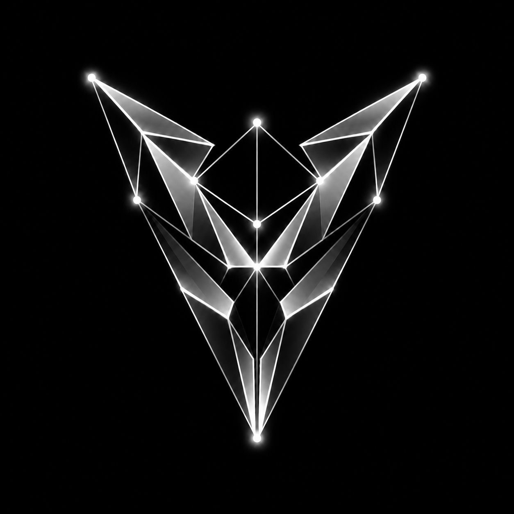

# Introduction

**Vertexy** is a modular, CLI-based toolchain designed for working with Solana programs.  
It combines **static analysis**, **reverse engineering**, and **project building** features in one streamlined developer and auditor experience.

---

## What Is Vertexy?

Vertexy provides tools for:

- **Building Solana programs**:
  - Supports both `Anchor` and native `SBF` workflows
  - Handles compilation and artifact organization

- **Recap**:
  - Produces a compact, audit-friendly summary per program/IDL
  - Extracts instruction-level metadata (Signers, Writable, Constrained, Seeded, Memory)
  - Maps IDLs to Anchor crates and performs lightweight source parsing to surface constraints, seeds and memory usage
  - Ideal as a quick starting report for security reviews and audits

- **Static Application Security Testing (SAST)**:
  - Uses a custom Starlark-based rule engine
  - Applies pattern-matching on the Rust AST
  - Enables writing domain-specific security rules

- **Reverse Engineering**:
  - Disassembles compiled sBPF bytecode
  - Exports Control Flow Graphs in `.dot` format
  - Tracks and formats immediate data from RODATA
  - Annotations simplified with Rust-like pseudocode

- **Dotting**:
  - Lets you manually reinsert functions into reduced CFGs from the full `.dot` graph
  - Useful for selectively exploring large or complex programs

- **Fetcher**:
  - Retrieves deployed `.so` binaries from Solana RPC endpoints using a program ID
  - Makes it easy to reverse-engineer or audit programs without local builds

---

## Why Vertexy?

While tools like `solana`, `cargo build-sbf`, or `anchor build` focus on building and deployment, Vertexy targets:

- **Security auditing workflows**
- **Automated code review pipelines**
- **Understanding bytecode-level structure**
- **Writing and applying custom static rules**

It integrates tightly with Solana's BPF toolchain and `syn` parsing to provide source-level and binary-level insights in one place.

---

## Project Structure

Vertexy is structured into several engines and CLI commands:

* [`build`](cli/build.md) – Compile programs and prepare artifacts
* [`recap`](cli/recap.md) – Generate quick IDL+source summaries for audits (instruction tables, constraints, seeds, memory flags)
* [`scan`](cli/scan.md) – Run static analysis with Starlark rules
* [`reverse`](cli/reverse.md) – Perform bytecode reverse engineering
* [`dotting`](reverse/dotting.md) – Post-process `.dot` graphs to manually restore functions in reduced CFGs
* [`fetch`](cli/fetch.md) – Retrieve deployed on-chain bytecode for offline inspection

See the full [CLI Usage](cli_usage.md) section for more details.

---

## Requirements

- Rust + Cargo
- Solana Toolchain (for `cargo build-sbf`)
- (Optional) [`anchor`](https://www.anchor-lang.com/) for Anchor support
- [`mdbook`](https://rust-lang.github.io/mdBook/) if you are contributing to or browsing the documentation locally

---

## Next Steps

- 👉 [Installation](installation.md)
- 👉 [Build your first project](cli/build.md)
- 👉 [Write a custom rule](rules/format.md)
